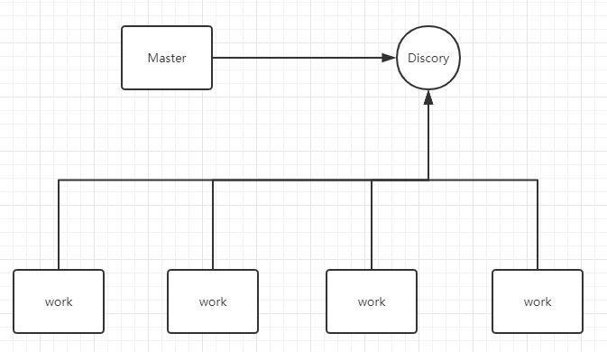

# ddbfc
Distributed DNS brute force cracking   分布式Dns暴力破解

work初始化 注册到Discory    
master 初始化字典  将字典进行分割成任务队列  下发个给work  将当前下发任务放入执行任务中

work完成任务 向master返回   master向执行任务中表删除结束任务

如果执行中任务超时  广播删除此任务 再重新下发任务

### 这是Cli 本地并发版
字典放入dic目录下 会自动检测 (如果没有会使用基础字典)